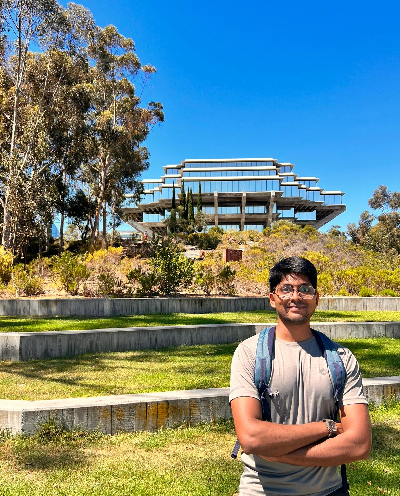



  

    <h2>University of California, San Diego</h2>
    
Location: San Diego, CA, USA

    
Degree: Masters in Electrical and Computer Engineering

    
Specialization: Intelligent Systems, Robotics and Control

    
Expected Graduation: June 2024

  

  

    

      
    

  

## Indian Institute of Technology (IIT), Tirupati

Location: Tirupati, India

Degree: Bachelor of Technology in Electrical Engineering

Duration: August 2019 - (Expected) June 2023
