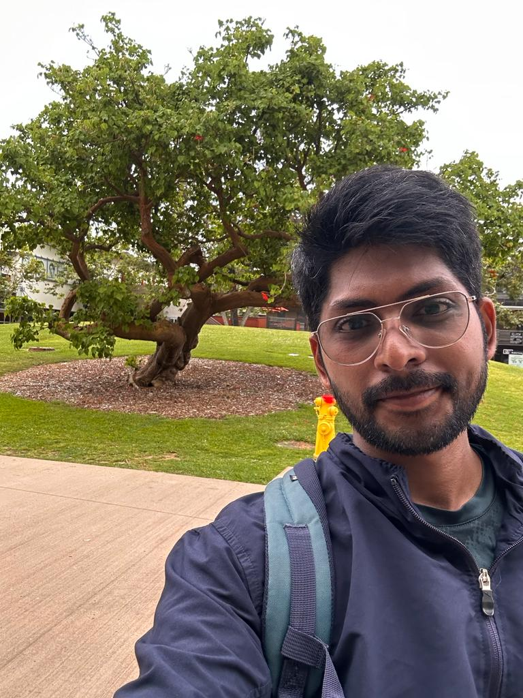



 

## University of California, San Diego

Location: San Diego, CA, USA

Degree: MS Electrical and Computer Engineering

Specialization: Intelligent Systems, Robotics and Control

Expected Graduation: June 2024

## Indian Institute of Technology (IIT), Tirupati

Location: Tirupati, India

Degree: Bachelor of Technology in Electrical Engineering

Duration: August 2019 - (Expected) June 2023

