

## Robotics and Autonomous Systems Projects

This repository showcases a collection of robotics and autonomous systems projects that I have worked on. Each project demonstrates my expertise in various areas of robotics, including SLAM, autonomous navigation, trajectory tracking, and motion planning.

### [Particle Filter SLAM](https://github.com/suryapilla/Particle-Filter-SLAM)  
- Developed a Particle Filter algorithm for indoor localization and mapping of a differential-drive robot.  
Utilized LiDAR data to generate a probabilistic occupancy grid of an unknown environment.

  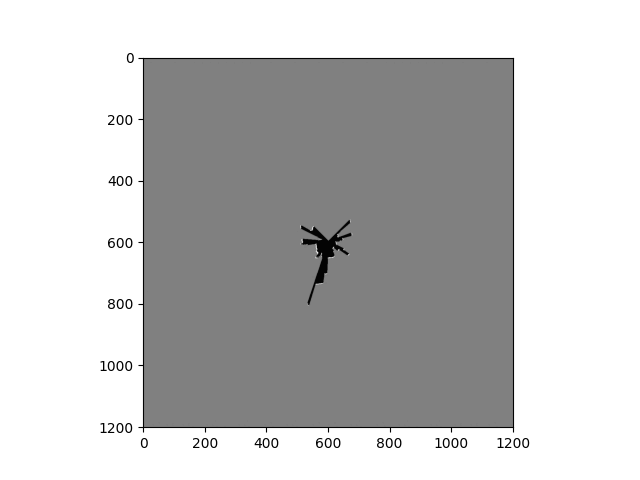
  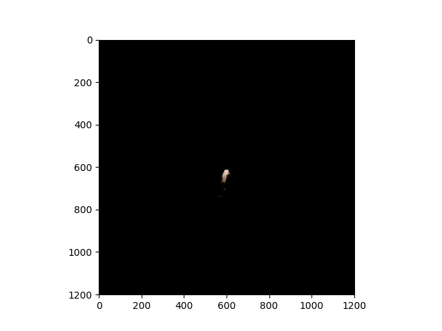

### [Visual Inertial SLAM](https://github.com/suryapilla/VISLAM)
- Implemented Visual Inertial SLAM (VI SLAM) using an Extended Kalman Filter approach.
- Fused sensor measurements from gyroscope, accelerometer, and camera to track the 3D pose of the robot and create a landmark map.

  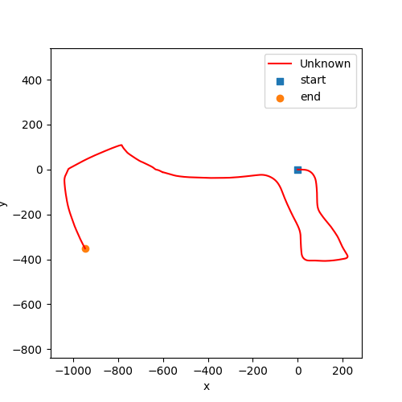
  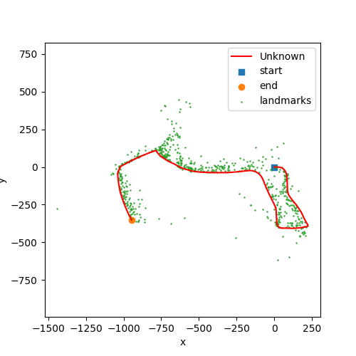

### [Autonomous Navigation](https://github.com/suryapilla/Autonomous-Navigation)
- Designed and implemented a dynamic programming algorithm for deterministic shortest path planning.
- Optimized control actions to find the shortest path from a starting point to a key location while avoiding obstacles.

  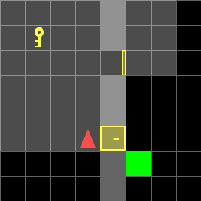
  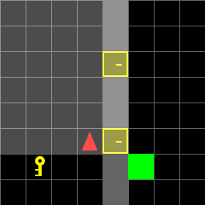

### [Trajectory Tracking](https://github.com/suryapilla/Trajectory-Tracking.git)
- Solved a non-linear optimization problem using Python CasADi solver.
- Developed an optimal control policy for accurate trajectory tracking.
- Compared the performance of Receding-Horizon Certainty Equivalent Control and Generalized Policy Iteration techniques.

  
  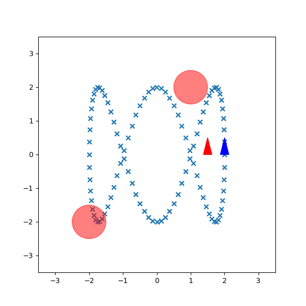

### [Motion Planning](https://github.com/suryapilla/motion-planning.git)
- Compared search-based (A*) and sampling-based (RRT) algorithms in a continuous 3D environment.
- Evaluated their efficiency and effectiveness for generating collision-free paths.

  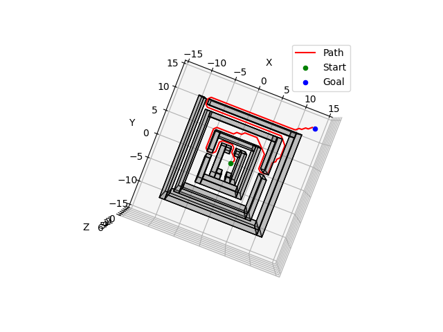
  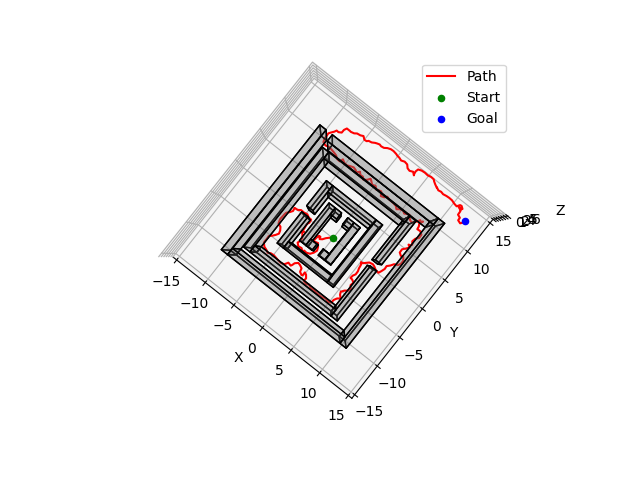

 

  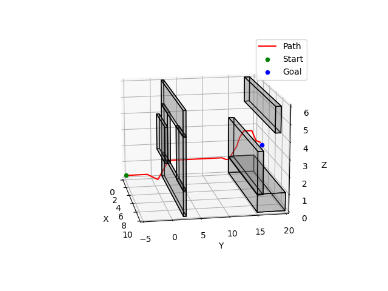
  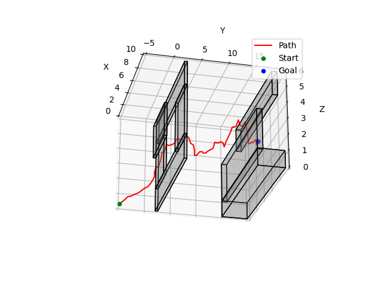

### [Image segmentation for Carla Dataset](../files/segmentation.pdf)
- Trained a PyTorch-based UNet architecture with attention and the Deeplabv3 with Resnet 101
backbone architecture to perform semantic segmentation for road object detection on a pixel level achiving accuracy of 91 and 82 respectively.

These projects demonstrate my proficiency in robotics algorithms, sensor fusion, path planning, and control optimization. Each project represents my ability to apply theoretical concepts to practical robotics challenges.
